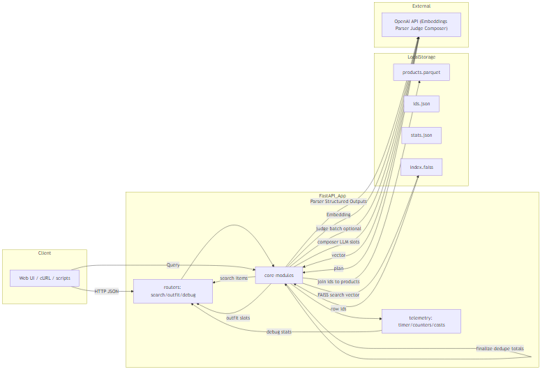
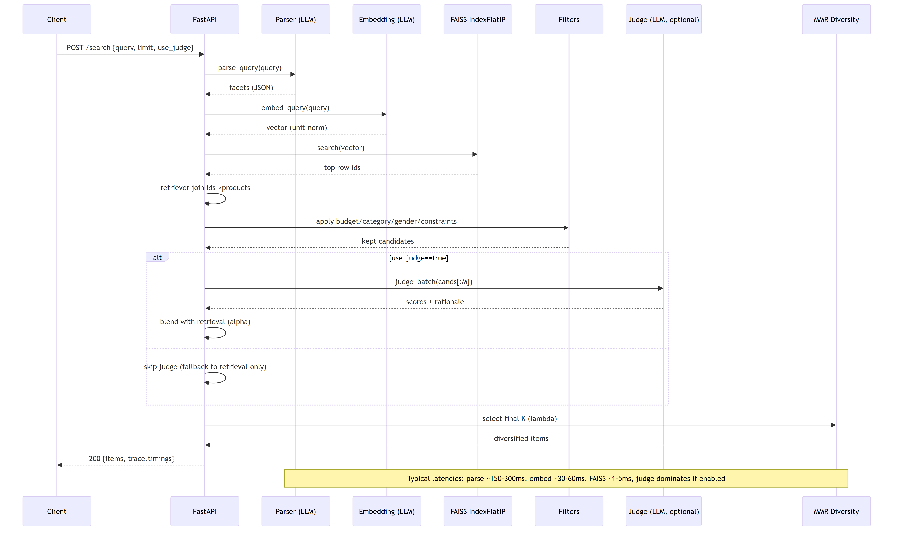
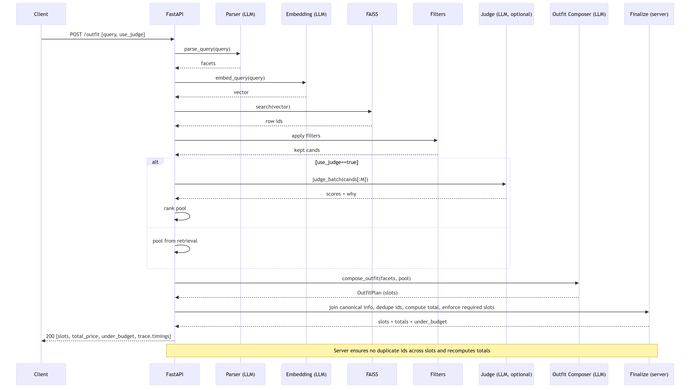

# Semantic Fashion Recs — FAISS + OpenAI (parser/judge/outfit)

Semantic search and outfit composition service using FAISS (IndexFlatIP) and OpenAI for parsing, judging, and composing. Telemetry captures token usage, timings, and estimated cost.

## Highlights
- Semantic queries (e.g., "beach trip under $120", "smart casual office outfit")
- FAISS exact search (IndexFlatIP) on ~826k items (1536-D unit vectors)
- LLM parser with Structured Outputs; judge reranker (batch + caching)
- MMR diversity + outfit composer (slot-based)
- Telemetry with token/latency/cost; `/debug/stats` and eval scripts

## Architecture


Sequence diagrams:





If the images are missing, render them first:
```bash
make diagrams
```

## Prerequisites
- Python 3.11
- Windows note: FAISS requires NumPy < 2. Install FAISS from conda-forge: `conda install -c conda-forge faiss-cpu`
- OpenAI API key in environment or `.env`

## Quickstart
```bash
python -m pip install -U pip
python -m pip install -r requirements.txt

# Create .env (set OPENAI_API_KEY and optional MODEL_*)
# Build embeddings and FAISS (see scripts/index.py options)
python scripts/index.py --embed
python scripts/index.py --build-faiss

# Run API
uvicorn src.app:app --reload
```

Health:
```bash
curl http://127.0.0.1:8000/healthz
```

## Environment variables
- `OPENAI_API_KEY` (required)
- `OPENAI_BASE_URL` (optional)
- `MODEL_EMBED` default `text-embedding-3-small`
- `MODEL_PARSER` default `gpt-4o-mini`
- `MODEL_JUDGE` default = `MODEL_PARSER`
- `INDEX_PATH`, `PARQUET_PATH`, `K_RETRIEVE`, `TOP_K_DEFAULT`, `MMR_LAMBDA`, `USE_JUDGE_DEFAULT`
- Outfit: `OUTFIT_*` (slots, pool size, timeouts, tolerance)

Note: temperature=0 is used when supported; we auto-fallback if the model rejects custom temperature.

## Judge Gating
Judge gating reduces latency and cost by running LLM judging only when it helps.

- Modes: SKIP (no judge), CHEAP (compact prompt, small top_m), FULL (standard)
- Request-level cache: keyed by SHA-1 of `(model, rubric_version, normalized query, fused topM ids)`
- Signals: retrieval margin/entropy, dense↔lexical Jaccard, budget/category/dup ratios, specificity
- Telemetry: `/debug/stats` → `judge_gate` shows skipped/cheap/full, escalations, cache hits/misses, and `cost_saved_usd_est`

Config knobs (env, with defaults):
- `JUDGE_GATE_ENABLE=true`
- `JUDGE_CHEAP_TOP_M=12`, `JUDGE_FULL_TOP_M=24`
- `JUDGE_MARGIN_SKIP_MIN=0.05`, `JUDGE_ENTROPY_SKIP_MAX=1.2`, `JUDGE_JACCARD_SKIP_MIN=0.6`
- `JUDGE_BUDGET_OK_SKIP_MIN=0.8`, `JUDGE_CATEGORY_OK_SKIP_MIN=0.7`, `JUDGE_DUP_SKIP_MAX=0.25`
- `JUDGE_TOLERANCE_BUDGET=0.05`, `JUDGE_GATE_TIMEOUT_SECS=10`
- `JUDGE_CACHE_SIZE=8000`, `JUDGE_CACHE_TTL_SECS=86400`
- `JUDGE_COST_PER_REQ_USD_MAX=0.015`, `JUDGE_DAILY_COST_USD_MAX=10`
- `RUBRIC_VERSION=1` (bump when changing the judge prompt/rubric)

Public API responses are unchanged; the `trace` (when `debug=true`) now includes a `judge_gate` object with mode, top_m, reason, signals, cache, and escalation info.

## Endpoints
- `GET /healthz`
- `POST /debug/retrieve` body: `{ "query": "...", "k": 10 }`
- `POST /debug/parse` body: `{ "query": "..." }`
- `POST /search` body: `{ "query": "...", "limit": 12, "use_judge": true }`
- `POST /outfit` body: `{ "query": "...", "use_judge": true }`
- `GET /debug/stats`

Examples:
```bash
curl -X POST http://127.0.0.1:8000/search \
  -H "Content-Type: application/json" \
  -d '{"query":"linen shirt under $60","limit":12,"use_judge":false}'

curl -X POST http://127.0.0.1:8000/outfit \
  -H "Content-Type: application/json" \
  -d '{"query":"summer beach outfit under $150, light colors, linen","use_judge":true}'
```

## Design decisions & trade-offs
- OpenAI-heavy vs local: faster iteration; Structured Outputs for determinism; schema validation; fallbacks
- FAISS vs in-memory NumPy: 826k x 1536D ~4.7GB float32; FAISS gives C++ speed and easy ANN path
- IndexFlatIP now vs ANN later: quality first; API is switchable
- MMR & variant control: vector cosine + title Jaccard; hard cap on variants
- Budget: filters & judge penalty; outfit finalizer recomputes totals and ensures numeric total_price
- Resilience: retries and temperature fallback; judge failure -> retrieval-only

## Evaluation & diagnostics
Batch eval:
```bash
python scripts/eval_search_batch.py --in samples/queries_search.jsonl --out reports/
python scripts/eval_outfit_batch.py  --in samples/queries_outfit.jsonl --out reports/
python scripts/eval_cost_snapshot.py --out reports/
```
Smoke:
```bash
python scripts/eval_latency_smoke.py
```
Stats:
```bash
curl http://127.0.0.1:8000/debug/stats
```

## Troubleshooting
- Windows FAISS + NumPy: ensure `numpy>=1.26,<2`; install FAISS via conda-forge
- OpenAI errors: temperature not supported -> auto-retry without temperature
- Parser 422: reduce prompt complexity; we retry with validation hints
- Index mismatch: ensure `ids.json` length equals `index.ntotal`

## Repo layout
- `src/` (app/core/models/routers/telemetry)
- `scripts/` (index, smoke tests, eval, render_diagrams)
- `docs/` (mermaid + png/pdf)
- `data/` (ignored in VCS)
- `samples/` (queries)

## Diagrams
See `docs/README-diagrams.md`. Render with:
```bash
make diagrams
```

## License / Credits
MIT. Dataset attribution per assignment; built for evaluation via CodexCLI.

